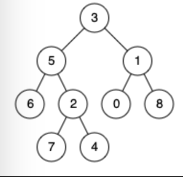

## Tasks
### 1. LCA in a tree
Given a binary tree, find the lowest common ancestor (LCA) of two given nodes in the tree.

According to the definition of LCA on Wikipedia: “The lowest common ancestor is defined between two nodes `p` and `q` as the lowest node in T that has both `p` and `q` as descendants (where we allow a node to be a descendant of itself).”

example: 


```
Input: root = [3,5,1,6,2,0,8,null,null,7,4], p = 5, q = 4
Output: 5
Explanation: The LCA of nodes 5 and 4 is 5, since a node can be a descendant of itself according to the LCA definition.
```

### 2. DFS
Given the first few pages, please follow the pattern and draw the next `5` pages of the dfs.

### 3. Numbers of Islands
Given an `4 * 4` matrix which represents a map of `1`s (land) and `0`s (water), return the number of islands.

An island is surrounded by water and is formed by connecting adjacent lands horizontally or vertically. You may assume all four edges of the grid are all surrounded by water.


Example:

```
Input: grid = [
  ["1","1","0","0","0"],
  ["1","1","0","0","0"],
  ["0","0","1","0","0"],
  ["0","0","0","1","1"]
]
Output: 3
```
### 4. Valid Brackets
Given a string s containing just the characters '(', ')', '{', '}', '[' and ']', determine if the input string is valid.

An input string is valid if:

- Open brackets must be closed by the same type of brackets.
- Open brackets must be closed in the correct order.
- Every close bracket has a corresponding open bracket of the same type.

```dotnetcli
Example 1:

Input: s = "()"

Output: true

Example 2:

Input: s = "()[]{}"

Output: true

Example 3:

Input: s = "(]"

Output: false

Example 4:

Input: s = "([])"

Output: true
```
